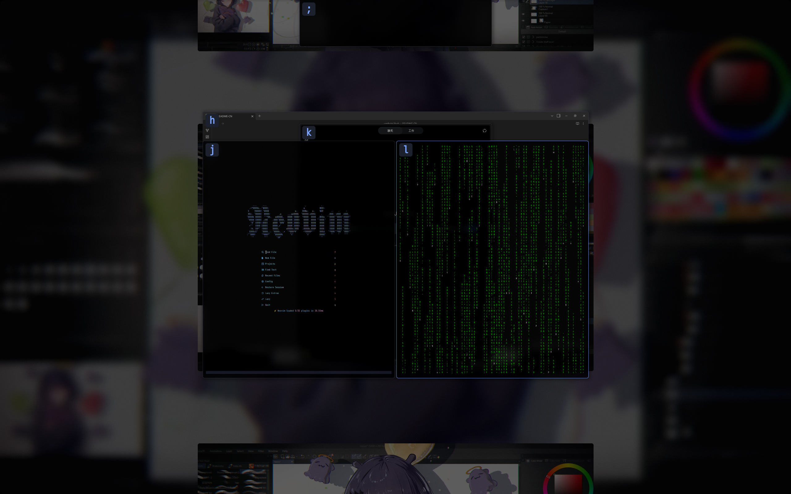

**Language / 语言:** [English](README.md) | [简体中文](README-CN.md)

# Umbriel Sink

Umbriel Sink is an experiment in tiled desktop interaction, inspired by [this talk on desktop UX](https://www.youtube.com/watch?v=V7AfAcQwLW0).
It explores a complement to tiling: how can a desktop preserve and represent the work context someone has just left,
letting it leave the active work surface without disappearing entirely from their cognitive space?

The project narrows that question to **suspending and resuming short-term work context**. It uses
[Umbriel](README-UMBRIEL.md) as an experimental platform and offers one concrete answer through a reversible
Sink/Pull depth stack. The desktop shows that context behind the active work surface; Overview exposes the same
stack for recognition and selection. This is not an official Noctalia project; the upstream overview, standard build
instructions, and dependencies remain in [README-UMBRIEL.md](README-UMBRIEL.md).

> **AI involvement:** AI (OpenAI Codex) participated in writing and modifying this fork's Sink/Pull implementation,
> related tests and scripts, and this document. Please review it against your own hardware and workflow.
> The original upstream Umbriel code should not be attributed to this fork or to AI.

## What Sink does

- `window-sink` pushes the focused window onto its Workspace's stack; `window-pull` restores the most recently sunk
  window (last in, first out).
- A sunk window retains its underlying tiled or floating placement, applicable window states, and Workspace occupancy,
  but no longer receives ordinary input or focus. The compositor projects the whole window to express depth without
  asking the client to resize merely for the visual effect.
- On the desktop, the top two entries are visible by default: depth 0 uses `0.93` scale and `0.82` opacity; depth 1
  uses `0.85` scale and `0.45` opacity. Deeper windows remain in the logical stack beyond the visibility horizon.
- In Overview, Sink windows share the horizontal centre of their Workspace preview and sit behind tiled, floating,
  and ordinary Fullscreen windows. The first `visible_depth` entries expose selectable tops; deeper entries form a
  bounded decorative tail. The foreground shifts down to balance the expanded stack, and reserved spacing keeps
  neighbouring previews apart.
- Sink and Pull also work inside Overview and leave it open. Stack changes push cards apart or fill the gap locally,
  without replaying the opening animation. Selecting a Sink entrance by click or shortcut unwinds the stack through
  that window and immediately starts closing Overview, as selecting an ordinary window does.
- Pull restores the window's placement. Outside Overview, keyboard focus returns after a compatible client commit;
  inside Overview, keyboard input remains withheld until Overview releases it. Explicit activation can also unwind
  the stack through a chosen sunk window, with the same content barrier.




## Quick start

After installing the separate session below, select **Umbriel Sink** at the login screen. An independently installed
official **Umbriel** session remains available. Building this repository alone does not update an installed session.

The fork-only configuration is `~/.config/umbriel-sink/config.toml`. The following example inherits an existing
Umbriel configuration, adds Sink/Pull bindings, and makes the desktop and Overview defaults explicit:

```toml
[include]
files = ["../umbriel/config.toml"]

[keybinds]
"Mod+Alt+Down" = "window-sink"
"Mod+Alt+Up" = "window-pull"

[appearance.sink]
visible_depth = 2
levels = [
  { scale = 0.93, opacity = 0.82, blur_strength = 0.5 },
  { scale = 0.85, opacity = 0.45, blur_strength = 1.0 },
]
self_blur = false
blur_radius = 6
blur_samples = 9

[overview.sink]
exposure_height = 24
tail_height = 12
tail_decay = 0.5

[animation.overview.sink]
mode = "balanced"
```

The relative `include` inherits the base configuration's theme, keybindings, and window rules; settings in this file
override matching values. Without an existing Umbriel config, remove `[include]` and start from the
[full example config](examples/config.toml). When editing an existing file, merge keys into its existing tables
rather than declaring the same table twice.

Keep Sink/Pull bindings in the fork-only file rather than a keybinding file shared by both sessions: upstream Umbriel
does not recognize these actions. The chords above are examples; check your existing bindings for conflicts. The full
example config also includes Sink/Pull bindings, so use the keys appropriate to your configuration.

You can also send the actions from a terminal in the separate session without binding keys:

```sh
~/.local/libexec/umbriel-sink/umbriel-sink msg window-sink
~/.local/libexec/umbriel-sink/umbriel-sink msg window-pull
~/.local/libexec/umbriel-sink/umbriel-sink windows --json
```

In `windows --json`, `sunk` and `sink_depth` describe logical state. `sink_depth = 0` is the top of the stack;
logical depth does not guarantee visibility. See the [actions](docs/user/actions.md) and [IPC](docs/user/ipc.md)
documentation for more detail.

## Desktop depth and Overview presentation

`appearance.sink.visible_depth` accepts 1–4. On the desktop it sets the number of visible whole-window projections;
in Overview it sets the number of full selectable tops. Deeper windows stay in the stack, with only a decorative tail
in Overview. The tail does not add a direct selection entrance for those windows.

`levels` defines desktop styles from nearest to farthest. Omitting it uses the built-in styles; a custom array needs
at least `visible_depth` complete entries. `scale` accepts 0.1–1, while `opacity` and `blur_strength` accept 0–1.
Self Blur samples the window itself and is off by default. When enabled, `blur_strength` selects the fraction of
`blur_radius` used at that depth. The radius accepts 1–32 logical pixels; `blur_samples` accepts 3–17 and reduces even
values to the next lower odd count. See the [appearance documentation](docs/user/appearance.md) for all defaults.

In fully open Overview, Sink cards use their source dimensions with the ordinary Overview zoom, and their independent
depth scale, opacity and Self Blur are removed. The top of each selectable layer exposes `exposure_height` logical
pixels in the final preview; a shorter window only accepts clicks within its actual content. The deeper tail shrinks
successive strips rather than making the expanded stack indefinitely taller:

| Setting | Default | Meaning |
| --- | --- | --- |
| `exposure_height` | `24` | Height of each selectable top, from 1 to 256 logical pixels. |
| `tail_height` | `12` | Combined height limit for the decorative tail, from 0 to 256; 0 removes its exposure. |
| `tail_decay` | `0.5` | Ratio between successive tail strips, strictly between 0 and 1. |

The foreground moves down by half the stack's exposed height. Overview reserves configured Sink capacity and window
bounds when organizing its previews; local Sink/Pull changes keep those gaps fixed. This also leaves room for the
first Sink in an initially empty stack.

`animation.overview.sink.mode` controls how Sink's desktop presentation meets Overview:

| Mode | Size, expansion and foreground offset | Independent depth opacity and Self Blur |
| --- | --- | --- |
| `performance` | Switch immediately. | Switch off on open and return on close. |
| `balanced` (default) | Interpolate with Overview. | Switch off on open and return on close. |
| `smooth` | Interpolate with Overview. | Interpolate with the same progress. |

All animated parts share Overview's actual progress and finish together, including when reversing midway; the modes
do not stagger layers or add a separate duration. Disabling global or Overview animation makes the transition
immediate. Local Sink/Pull reflow uses `animation.windows_move`; `performance` or disabled relevant animations makes
that reflow immediate. Use `mode = "smooth"` for the full effect handoff. Self Blur still requires
`appearance.sink.self_blur = true`; choosing `smooth` alone does not enable it. Interaction details are in
[Sink in Overview](docs/user/workspaces-overview.md#sink-in-overview).

Showing three or four desktop layers, especially with Self Blur, can increase GPU cost. Existing performance
measurements mainly cover the default two-layer horizon, so they do not establish the cost of extra layers or a
frame-rate difference between the modes. Validate and hot-reload configuration changes with:

```sh
~/.local/libexec/umbriel-sink/umbriel-sink validate -c ~/.config/umbriel-sink/config.toml
~/.local/libexec/umbriel-sink/umbriel-sink msg config-reload
```

## Build and install the separate session

For a first build, see the upstream [README-UMBRIEL.md](README-UMBRIEL.md#building) for dependencies. The separate
session uses its own Release build; do not run `just install` to replace an official Umbriel installation:

```sh
meson setup build-sink-release --buildtype=release -Db_lto=true -Dtests=disabled -Dcpp_std=c++23 --prefix="$HOME/.local"
meson compile -C build-sink-release umbriel
```

If `build-sink-release/` already exists, only the second command is needed. Log out of a running Umbriel Sink session
before updating its binary and configuration. These are suggested paths for a separate installation, not replacements
for the official session. The `build*/` directories and `compile_commands.json` are ignored by [`.gitignore`](.gitignore);
do not commit or force-add build products.

| Repository file | Suggested installed location / purpose |
| --- | --- |
| `build-sink-release/umbriel` | `~/.local/libexec/umbriel-sink/umbriel-sink`, separate compositor binary |
| [`tools/sink-session/start-umbriel-sink`](tools/sink-session/start-umbriel-sink) | `~/.local/bin/start-umbriel-sink`, login launcher |
| [`tools/sink-session/umbriel-sink.service`](tools/sink-session/umbriel-sink.service) | `~/.config/systemd/user/umbriel-sink.service`, user service |
| [`tools/sink-session/umbriel-sink.desktop.in`](tools/sink-session/umbriel-sink.desktop.in) | Login entry template; the user's launcher path is filled in at install time |
| [`tools/sink-session/install-session-entry.sh`](tools/sink-session/install-session-entry.sh) | Renders the template and installs only the separate login entry with administrator privileges |
| Fork-only config | `~/.config/umbriel-sink/config.toml`, which may `include` an upstream config |

For a first installation, prepare the fork-only config above, then install the binary, launcher, and user service:

```sh
install -Dm755 build-sink-release/umbriel "$HOME/.local/libexec/umbriel-sink/umbriel-sink"
install -Dm755 tools/sink-session/start-umbriel-sink "$HOME/.local/bin/start-umbriel-sink"
install -Dm644 tools/sink-session/umbriel-sink.service "$HOME/.config/systemd/user/umbriel-sink.service"
systemctl --user daemon-reload
```

For an existing installation, rebuild and replace the private binary after logging out. Keep its configuration on the
same interface version: replace any old animation `type` setting with `mode` and one of the values above. Validate
with the newly installed binary before returning to the session.

The login entry is generated from a template; no user's home path is stored in the repository. Preview the rendered
entry, then install it:

```sh
tools/sink-session/install-session-entry.sh --render
tools/sink-session/install-session-entry.sh
```

The script resolves the default launcher under `$HOME` and writes its path to the system session directory only at
install time. If your launcher lives elsewhere, pass its absolute path without spaces or special characters as an
argument. The script calls `sudo` but does not overwrite the official session entry. See
[`tools/sink-session/README.md`](tools/sink-session/README.md) for session isolation and path details. The separate
entry and service leave the official `umbriel.desktop`, `umbriel.service`, `start-umbriel`, and config untouched.

## Code, tests, and status

The Sink stack and desktop presentation live in `src/workspace/sink_stack.h`, `src/workspace/sink_presentation.h`,
`src/workspace/workspace.cpp`, and `src/scene/window_projection.*`. Overview cards, geometry and shared transitions
live in `src/overview/overview.*` and `src/overview/sink_layout.*`. Configuration parsing is in `src/config/`, and
Self Blur rendering is in `umbrielfx/`.

The GPU harness covers desktop Sink/Pull, projection and Self Blur, along with Overview centring, layering, entrances,
spacing, animation modes, local actions and lifecycle handoff. The Overview checks are grouped under `overview_sink`,
including `382_overview_sink_style_transition.sh` for actual size, opacity and blur transitions. The real-application
smoke-test script is [`tests/manual/sink_real_apps.sh`](tests/manual/sink_real_apps.sh).

```sh
just test debug
just check 155_sink_logic 156_sink_projection 158_sink_self_blur overview_sink
```

The GPU harness needs an available DRM render node. A successful build or pure-logic unit test is not, by itself,
validation on a real GPU or native seat. Core Sink/Pull and its Overview presentation are implemented; native daily
use, Self Blur and expanded visible depth remain under personal evaluation and performance tuning. See
[LICENSE](LICENSE) for the upstream license; changes in this fork must also follow the repository license.
